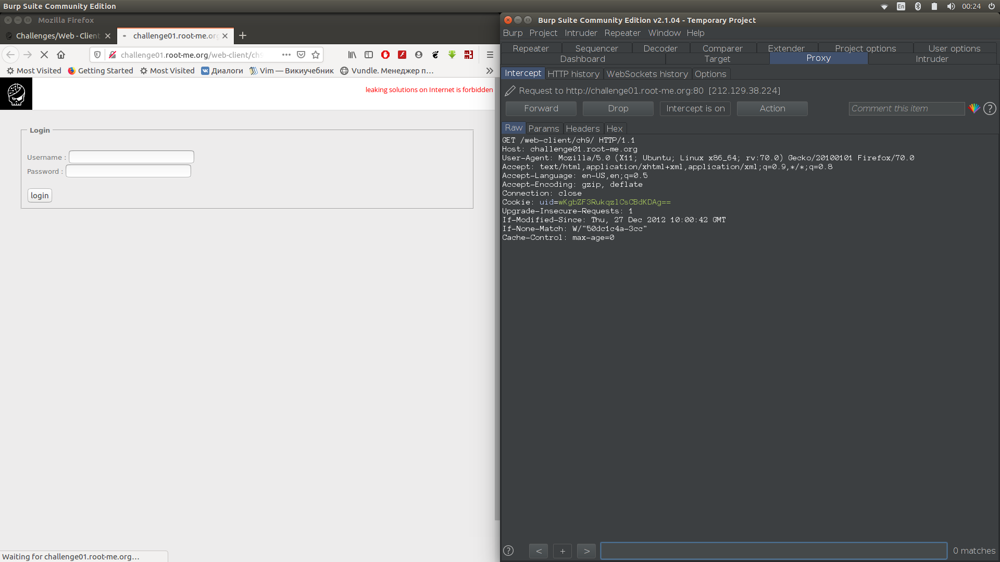
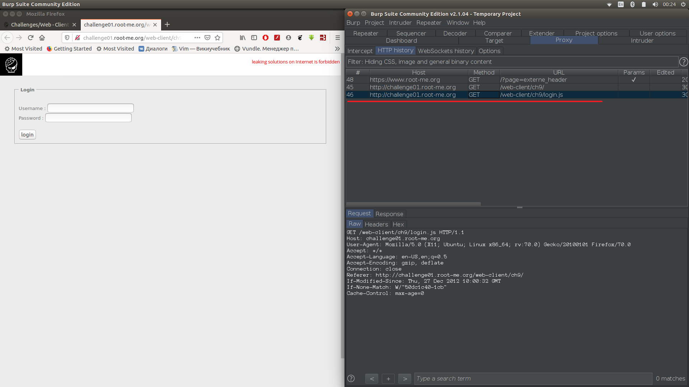
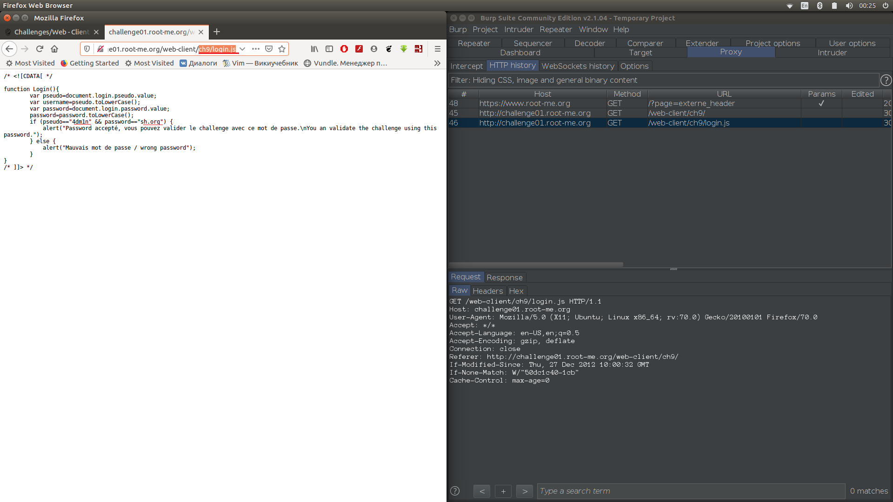
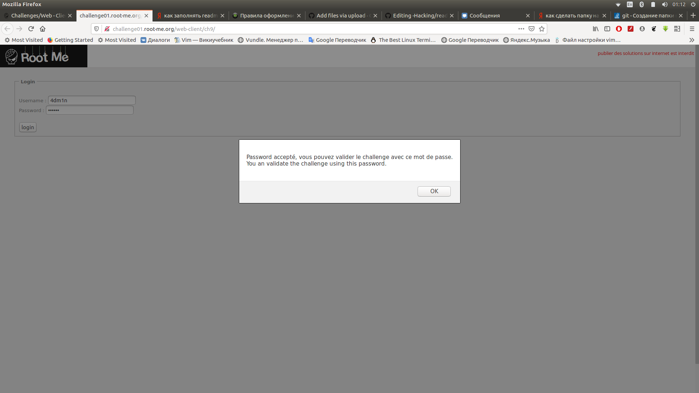
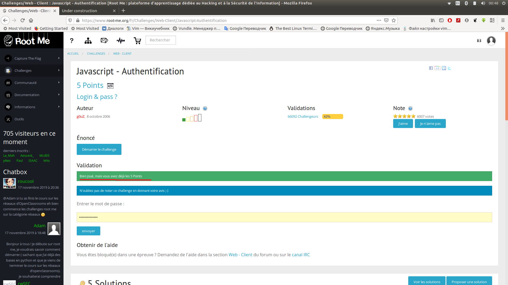

1) Открываем заданием и видим 2 поля username/password.Обновляем страницу и в Burp пролистываем все запросы.

2) В Burp переходим во вкладку HTTPhistory и замечаем там запрос, где url содержится файл login.js

3) К начальному URL добавляем путь до login.js. И видим сравнение заполненых нами полей с истинным значениями логина и пароля.

4)Вводим их на странице 

5) Вводим пароль в задании

