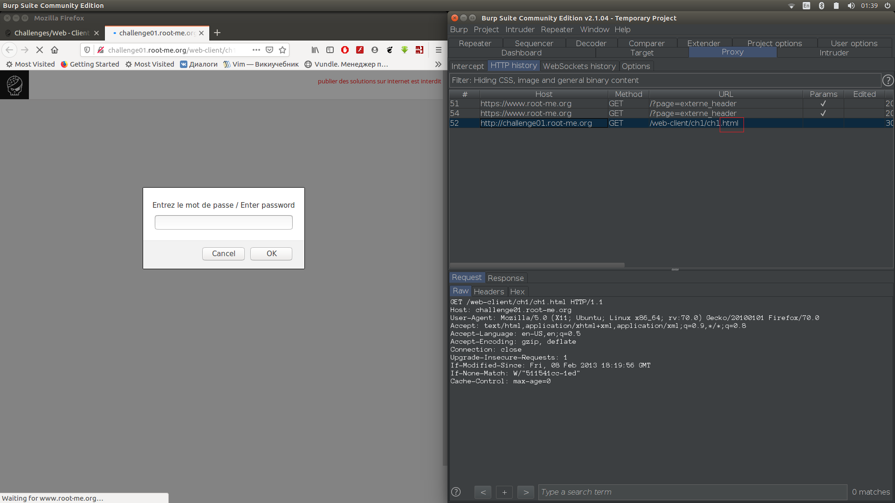
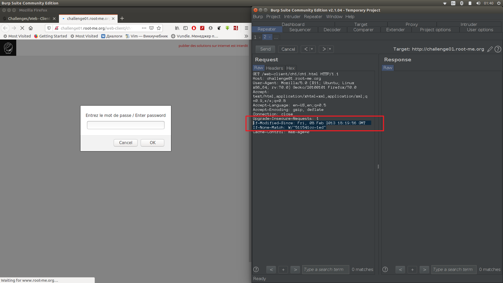
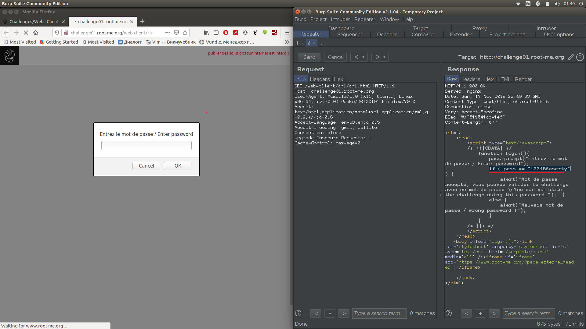
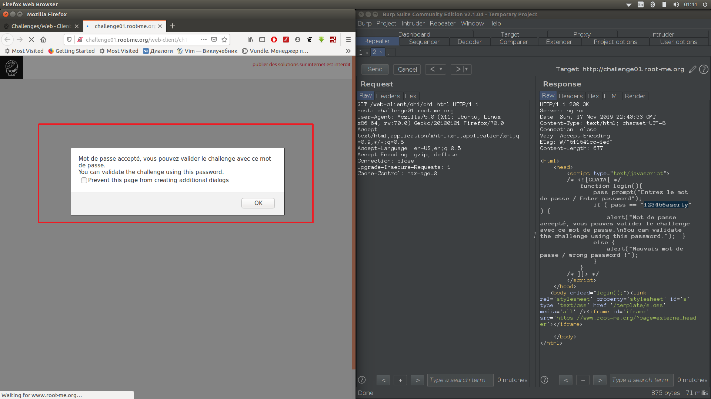

1) Открываем задачу и вводим что угодно в предложенное поле, жмём "ок" и обновляем страницу с помощью  Burp 

2) Затем заходим во вкладку HTTP history в Burp и видим там один файл. Замечаем, что в запросе была строка if-modified-since.
   Отправляем файл в Repeater.

3) Удаляем строки, которые дадут в ответе ошибку 304, и отправляем запрос.

4) В ответе замечаем сравнение с настоязим паролем

5) Вводим полученный пароль в поле на странице.

