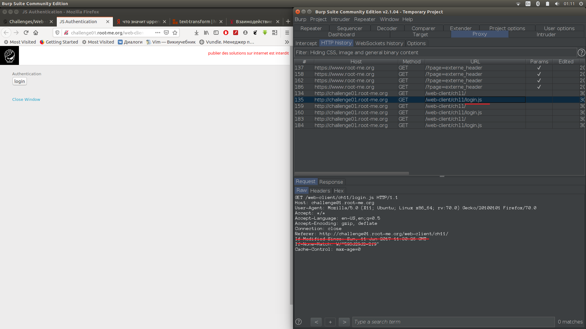
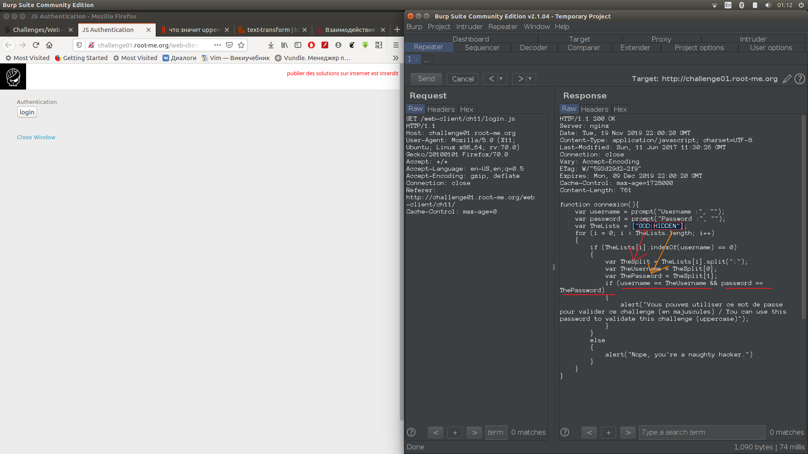
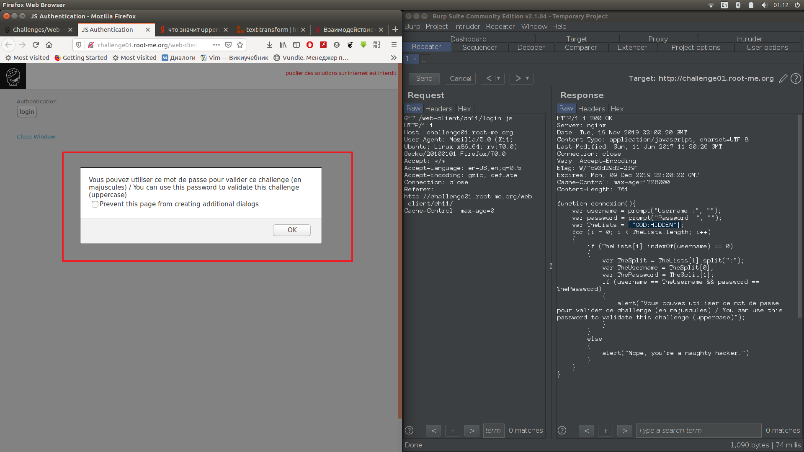

1.  Открыли задание, обновили задание и смотрим на HTT history в Burp. Там файл login.js, отправили его в Repeater, 
     удалив If Modified... 

2.  Из полученного ответа находим login/password

3.  Вводим их на сайте и проходим задание

