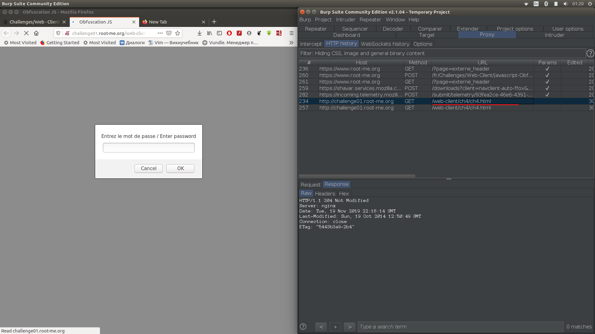
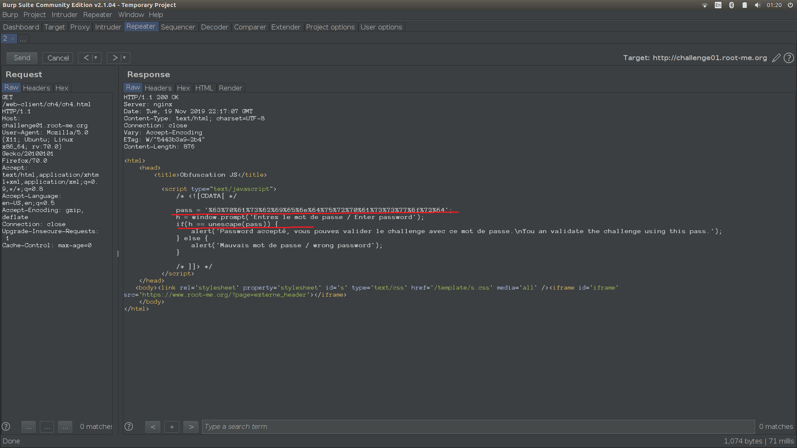
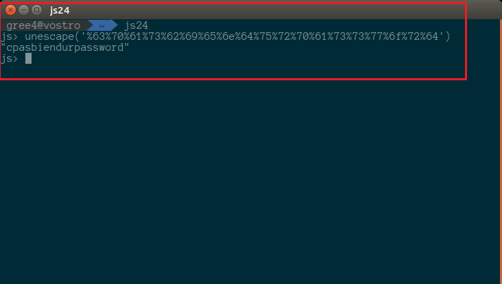
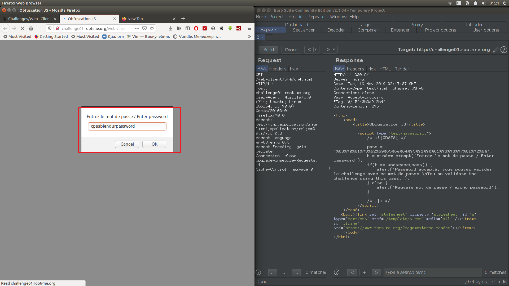
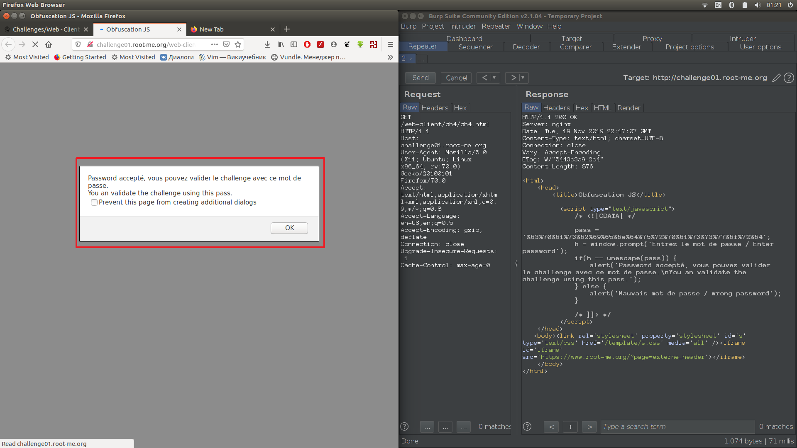

1. Открываем задание, обновляем страниц и смотрим, что появилось в HTTP history в burp, там появился файла ch4.html.
    Отправляем в Reapeter и удаляем If Modif ...

2. В ответе видим переменную pass, чьё значение потом сравнивается с введённым нами значением

3. Применяем функцию к строке из pass, как в ответе

4. Полученный результат вводим

5. Все правильно

