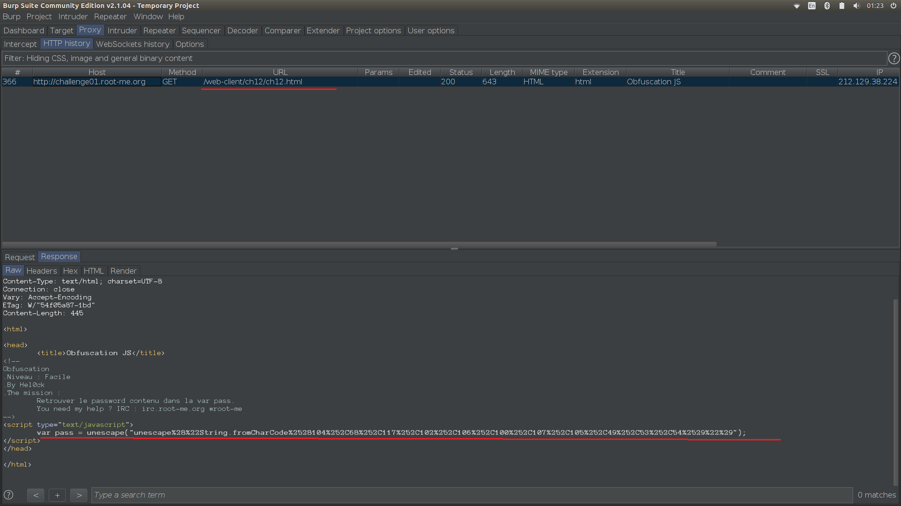
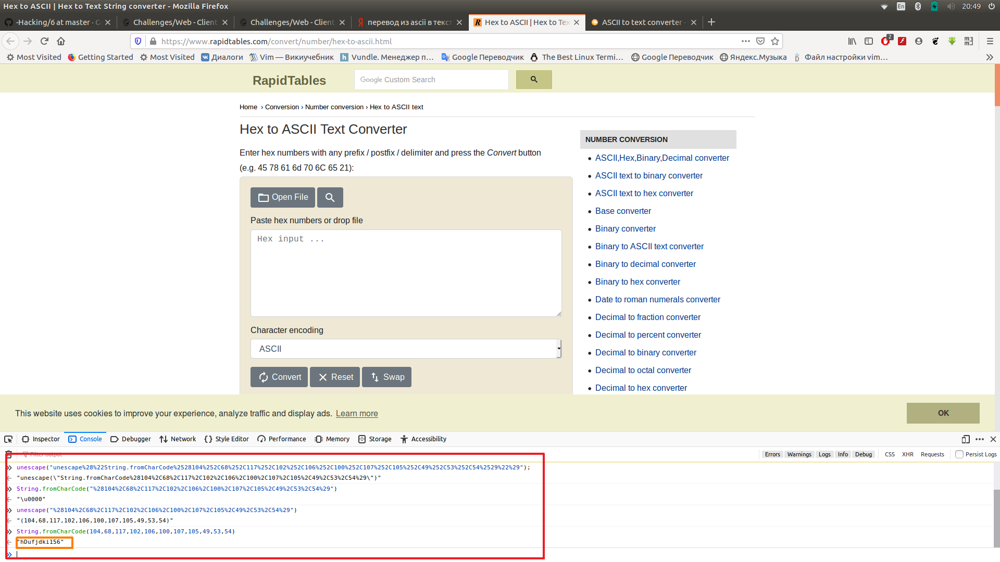
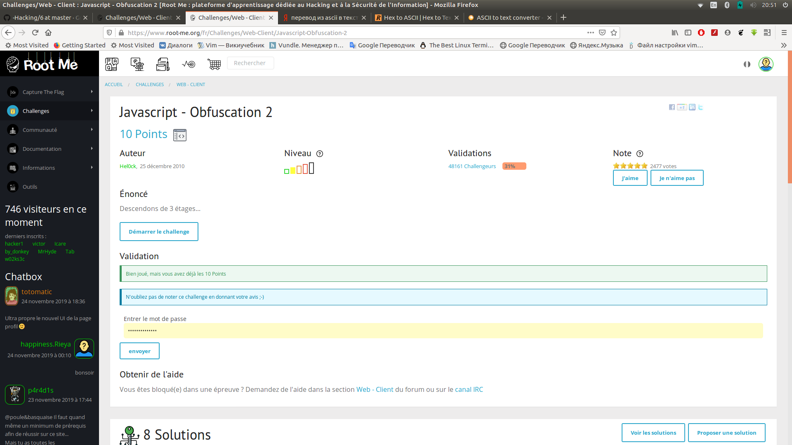

1.  Открываем страницу задания и смотрим в Burp HTTP history, видим там
    единственный файл. В нём переменную  pass

2.  Проделываем те же операции с переменной pass, что и в ответе

3.  Мы получили правильный ответ

