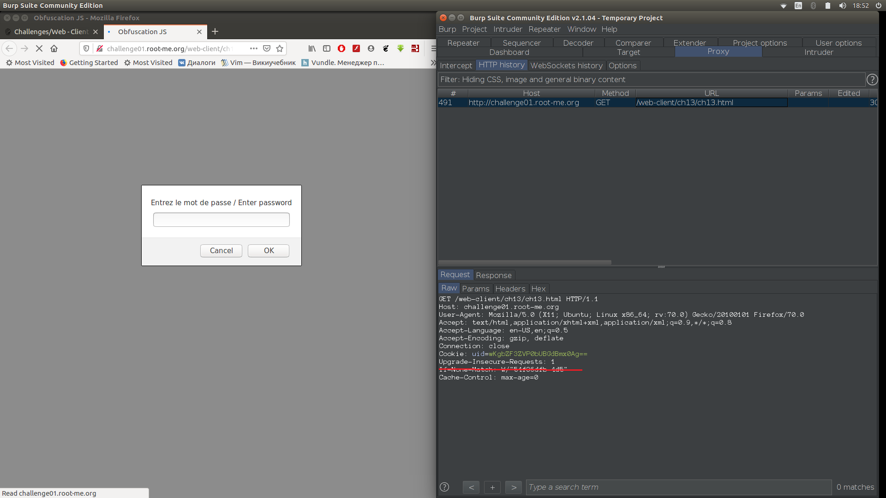
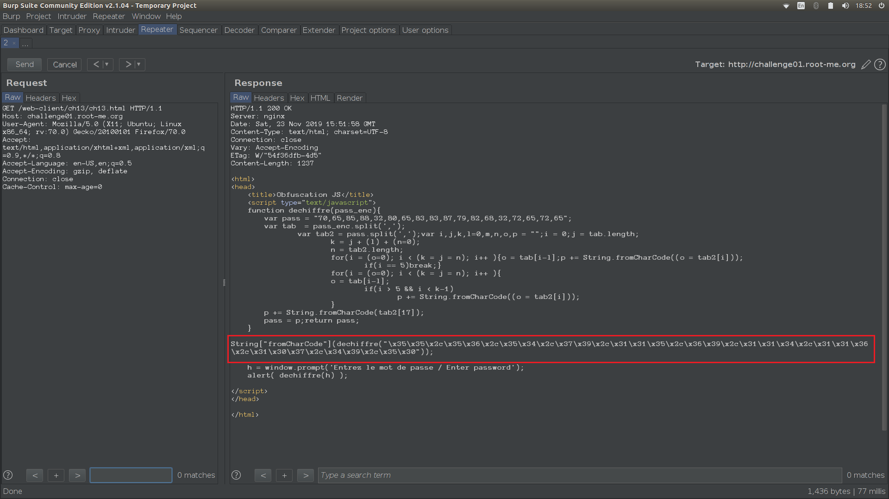
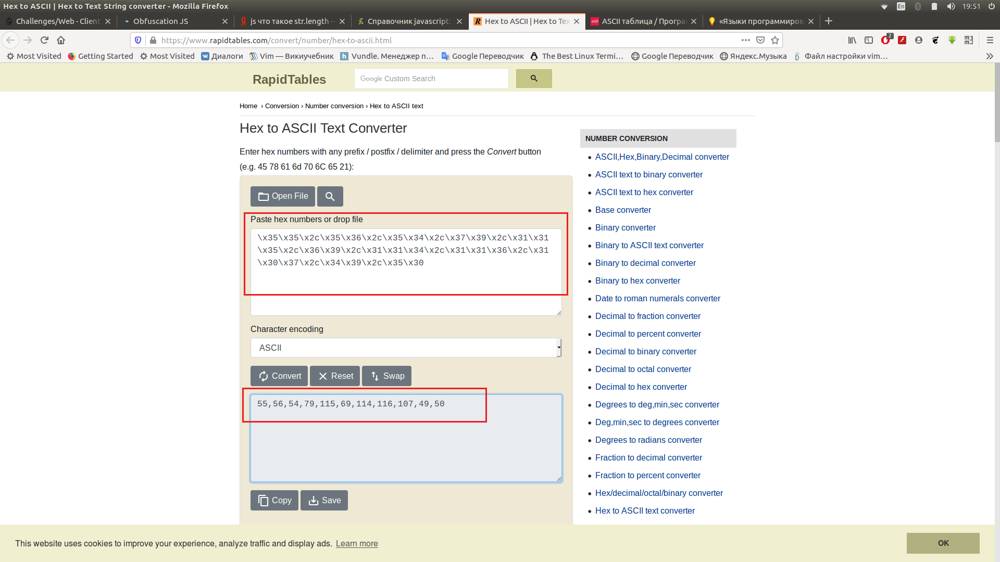
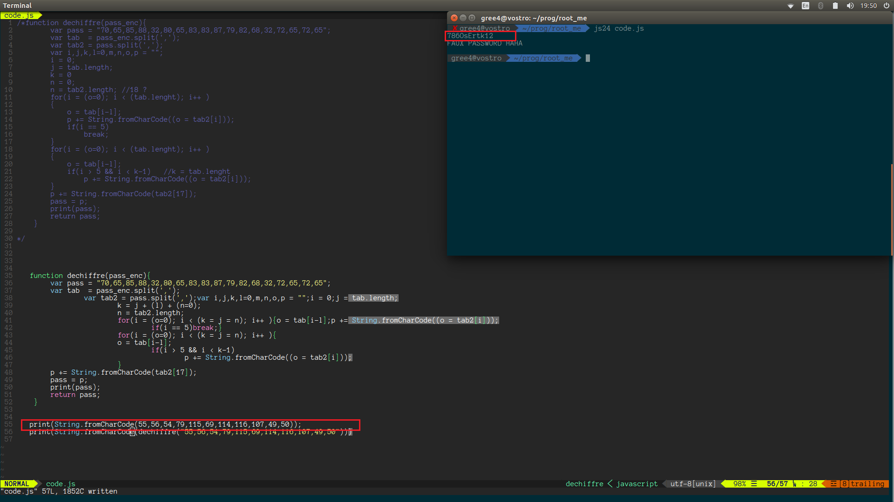

1.  Открываем задание обновляем, отправляем в Reapeter без If Modif...
    
2.  В коде видим строку, с которой сравнивается в функции введённое нами 
    значение. Последовательно \x... это явно ASCI код в 16-ричном  
    представлении
    
3.  Переводим ASCI в символы
    
4.  И к получившемуся коду применяем String.fromCharCode
    
5.  Вводим получившийся ответ на сайте
    
    
